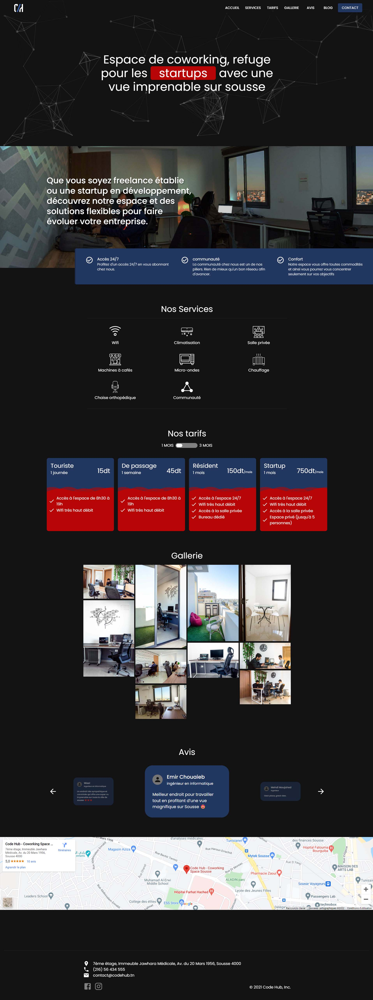

<!-- PROJECT PREVIEW -->
<br />
<center>

[](https://forthebadge.com) &nbsp;
[](https://forthebadge.com) &nbsp;

</center>

<!-- TABLE OF CONTENTS -->
<details open="open">
  <summary>Table of Contents</summary>
  <ol>
    <li>
      <a href="#about-the-project">About The Project</a>
      <ul>
        <li><a href="#built-with">Forking this project</a></li>
        <li><a href="#built-with">Screenshots</a></li>
        <li><a href="#built-with">Built With</a></li>
      </ul>
    </li>
    <li>
      <a href="#getting-started">Getting Started</a>
      <ul>
        <li><a href="#installation">Installation</a></li>
      </ul>
    </li>
    <li><a href="#contributing">Contributing</a></li>
    <li><a href="#license">License</a></li>
    <li><a href="#contact">Contact</a></li>
  </ol>
</details>

<!-- ABOUT THE PROJECT -->

## About The Project

Second version of <a href="https://www.codehub.tn" target="_blank">www.codehub.tn</a>

### Forking this project

If someone wants to use this code on his own website, the answer is **YES** BUT please with credits !
I've spent a non-trivial amount of effort building and designing this iteration of this website, and i am proud of it!

### Screenshots

<p align="center">
  <p align="center">Landing page</p>
  
</p>

### Built With

- [Next JS](https://nextjs.org/)
- [Material UI](https://material-ui.com/)
- [Framer Motion](https://www.framer.com/motion/)

<!-- GETTING STARTED -->

## Getting Started

If you want to clone the project

### Installation

1. Clone the repo
   ```sh
   git clone https://github.com/your_username_/Project-Name.git
   ```
2. Install NPM packages
   ```sh
   npm install
   npm run dev
   ```

<!-- CONTRIBUTING -->

## Contributing

Contributions are what make the open source community such an amazing place to learn, inspire, and create. Any contributions you make are **greatly appreciated**.

1. Fork the Project
2. Create your Feature Branch (`git checkout -b feature/AmazingFeature`)
3. Commit your Changes (`git commit -m 'Add some AmazingFeature'`)
4. Push to the Branch (`git push origin feature/AmazingFeature`)
5. Open a Pull Request

<!-- LICENSE -->

## License

Distributed under the MIT License. See `LICENSE` for more information.

<!-- CONTACT -->

## Contact

Ahmed Ben Khalifa - [linkedIn](https://www.linkedin.com/in/ben-khalifa-ahmed/) - ahmedbenkhalifa1997@gmail.com

Project Link: [https://github.com/Ahmedbenkhalifa/coworking-website](https://github.com/Ahmedbenkhalifa/coworking-website)
